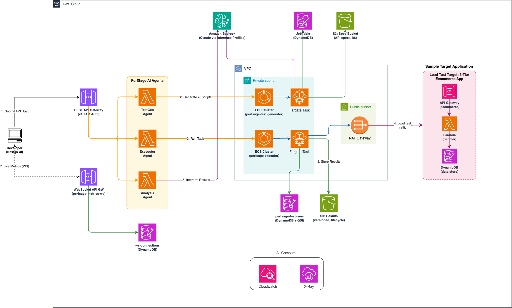

# PerfSage — AI-Powered Performance Testing Platform

## Table of Contents

- [Overview](#overview)
- [Architecture](#architecture)
- [Prerequisites](#prerequisites)
- [Project Structure](#project-structure)
- [Quick Start](#quick-start-full-stack)
- [Setting Up Each Agent](#setting-up-each-agent-independently)
- [AWS Resources Created](#aws-resources-created)
- [Architecture Deep-Dive](#architecture-deep-dive)
- [Deployment Flow](#deployment-flow)
- [Verify the Deployment](#verify-the-deployment)
- [Troubleshooting](#troubleshooting)
- [Documentation](#documentation)
- [Security](#security)
- [Cost](#cost)
- [Contributing](#contributing)
- [License](#license)

---

## Overview

PerfSage is an AI-powered performance testing platform that combines three autonomous agents to **generate**, **execute**, and **analyze** load tests end-to-end — from an OpenAPI specification to an actionable performance report — with no manual scripting required.

This tool demonstrates:

- **AI-driven test generation** — Transforms OpenAPI specs + natural language into production-quality k6 load test scripts using Amazon Bedrock (Claude)
- **Serverless execution at scale** — Runs k6 tests on AWS Fargate with automatic infrastructure provisioning, supporting 10k–100k+ record seeding
- **Intelligent analysis** — AI-powered root cause identification, SLO evaluation, and actionable remediation recommendations
- **One-command deployment** — Full AWS infrastructure via CDK with zero manual configuration
- **3-level dependency-aware seeding** — Automatically seeds parent→child→grandchild hierarchies with correct ID correlation

## Architecture

### Workflow

```
┌──────────────────┐     ┌──────────────────┐     ┌────────────────┐
│  TestGen Agent   │ ──▶ │  Executor Agent  │ ──▶ │  Analysis      │
│  (Fargate)       │     │  (Lambda+Fargate)│     │  Agent         │
│                  │     │                  │     │  (Lambda)      │
│  Generates k6    │     │  Runs k6 on      │     │  Interprets    │
│  scripts via     │     │  AWS Fargate     │     │  results via   │
│  Bedrock AI      │     │                  │     │  Bedrock AI    │
└──────────────────┘     └──────────────────┘     └────────────────┘
        ▲                                              │
        │            ┌──────────────────┐              │
        └────────────│    Frontend      │◀─────────────┘
                     │  (Next.js UI)    │
                     └──────────────────┘
```

### Architecture



| Layer | Components |
|---|---|
| **Edge** | Next.js frontend (localhost dev), API Gateway (IAM auth) |
| **Compute** | Lambda (orchestrators), Fargate (TestGen + k6 runners) |
| **AI** | Amazon Bedrock — Claude Sonnet 4.6 (generation + analysis), Claude Opus 4.7 (execution) |
| **Data** | DynamoDB (job state, test runs), S3 (specs, metrics, scripts) |
| **Network** | VPC with private subnets, NAT Gateway, security groups (egress-only) |
| **Observability** | X-Ray tracing, CloudWatch Logs, Container Insights |

### End-to-End Flow

1. **User** uploads OpenAPI spec + describes test in natural language via the UI
2. **Frontend** proxies request to TestGen Lambda (thin orchestrator)
3. **TestGen Lambda** uploads input to S3, launches Fargate task
4. **TestGen Fargate** calls Bedrock (Claude) to generate a k6 load test script, writes result to DynamoDB
5. **Frontend** polls DynamoDB until script is ready, displays it to user
6. **User** configures VUs, duration, target URL → clicks "Run Performance Test"
7. **Executor Lambda** receives script, provisions Fargate task with k6 runner
8. **k6 Fargate task** seeds test data (parent→child→grandchild), runs load test against target API
9. **k6 container** uploads `metrics.json` + `summary.json` to S3, updates DynamoDB status
10. **User** clicks "Run Analysis"
11. **Analysis Lambda** reads metrics from S3, calls Bedrock for AI-powered interpretation
12. **Analysis** returns: SLO verdict, root cause analysis, latency distribution, recommendations

---

## Prerequisites

| Tool    | Version | Install                                                 |
| ------- | ------- | ------------------------------------------------------- |
| Python  | 3.11+   | `brew install python@3.11`                              |
| Node.js | 18+     | `brew install node`                                     |
| Docker  | Any     | Docker Desktop or `brew install colima && colima start` |
| AWS CLI | v2      | `brew install awscli`                                   |
| AWS CDK | v2.150+ | `npm install -g aws-cdk`                                |

**AWS Requirements:**

- An AWS account with admin permissions
- AWS credentials configured (`aws configure`)
- Bedrock model access enabled for Claude models

---

## Project Structure

```
perfsage-initiative/
├── infra/               # Unified CDK infrastructure (all agents)
│   ├── app.py           #   CDK entry point
│   └── stacks/          #   agents_stack, storage, networking, execution
├── scripts/             # Deployment & utility scripts
│   ├── deploy.sh        #   Full AWS deployment (CDK + Docker image)
│   ├── cleanup.sh       #   Tear down local + AWS resources
│   └── local_run.sh     #   Run executor locally with Docker
├── docker/              # Docker configs for k6 runner + local dev
│   ├── Dockerfile.k6    #   k6 runner image (pushed to ECR)
│   ├── Dockerfile.agent #   Executor agent image (local dev)
│   └── docker-compose.yml
├── testgen_agent/       # Agent 1 — generates k6 scripts from API specs
├── executor_agent/      # Agent 2 — runs k6 tests on AWS Fargate
├── analysis_agent/      # Agent 3 — analyzes results + recommendations
├── sample_api/          # Sample CRUD API (Company→Employee→Address) — test target
├── frontend/            # Next.js UI — 3-step wizard
└── README.md
```

---

## Quick Start (Full Stack)

### 1. Configure AWS Credentials

```bash
# Option A: aws configure (interactive)
aws configure

# Option B: Export temporary credentials (Isengard/SSO)
export AWS_ACCESS_KEY_ID=...
export AWS_SECRET_ACCESS_KEY=...
export AWS_SESSION_TOKEN=...
export AWS_REGION=us-east-1
```

### 2. Deploy All Infrastructure (one command)

```bash
./scripts/deploy.sh
```

This single script:

1. Builds all 3 Lambda packages (TestGen, Executor, Analysis)
2. Bootstraps CDK (first time only)
3. Deploys 4 CloudFormation stacks (Storage, Networking, Execution, Agents)
4. Builds and pushes the k6 Docker image to ECR
5. Auto-generates `.env` with all resource IDs

Or deploy manually step-by-step:

```bash
# Build Lambda packages only
./scripts/build_packages.sh

# Then deploy CDK stacks
cd infra
python3 -m venv .venv
source .venv/bin/activate
pip install -r requirements.txt
cdk deploy --all --require-approval never
```

### 3. Start the Frontend

```bash
cd ../../frontend
npm install
cp .env.example .env.local
# Edit .env.local with your API Gateway URL and AWS credentials
npm run dev
```

Open `http://localhost:3000`

---

## Setting Up Each Agent Independently

### TestGen Agent (Agent 1)

**Purpose:** Transforms OpenAPI specs + natural language into executable k6 scripts.

```bash
cd testgen_agent

# Install dependencies
python3 -m venv .venv
source .venv/bin/activate
pip install -r requirements.txt

# Run locally (requires AWS credentials for Bedrock)
export AWS_ACCESS_KEY_ID=...
export AWS_SECRET_ACCESS_KEY=...
export AWS_SESSION_TOKEN=...

# Test with Streamlit UI
pip install streamlit
streamlit run demo_ui.py
```

**Deployed as:** Lambda (`perfsage-testgen-dev`) behind API Gateway.

---

### Executor Agent (Agent 2)

**Purpose:** Provisions Fargate, runs k6 load tests, streams metrics, persists results.

```bash
cd executor_agent

# Install
python3 -m venv .venv
source .venv/bin/activate
pip install -e .

# Configure AWS credentials
export AWS_ACCESS_KEY_ID=...
export AWS_SECRET_ACCESS_KEY=...
export AWS_SESSION_TOKEN=...

# Deploy infrastructure (one-time)
perfsage-executor deploy

# Run a test
perfsage-executor run -s tests/fixtures/sample_k6_script.js --vus 10 --duration 1m

# Check status
perfsage-executor status --test-id <test-id>
perfsage-executor list
```

**Deployed as:** Lambda (`perfsage-executor-dev`) + ECS Fargate tasks.

**CLI Commands:**
| Command | Description |
|---------|-------------|
| `perfsage-executor deploy` | Deploy all AWS infrastructure |
| `perfsage-executor run -s script.js` | Run a load test |
| `perfsage-executor status --test-id X` | Check test status |
| `perfsage-executor list` | List recent runs |
| `perfsage-executor destroy` | Tear down infrastructure |

---

### Analysis Agent (Agent 3)

**Purpose:** Interprets load test results, identifies root causes, generates recommendations.

```bash
cd analysis_agent

# Install (dev deps include boto3 + pytest for local runs/tests;
# the slim requirements.txt is what gets bundled into the Lambda)
python3 -m venv .venv
source .venv/bin/activate
pip install -r requirements-dev.txt

# Configure
export AWS_ACCESS_KEY_ID=...
export AWS_SECRET_ACCESS_KEY=...
export AWS_SESSION_TOKEN=...

# Run tests (no AWS/LLM needed) — from the repo root
cd .. && PYTHONPATH=. python -m pytest analysis_agent/tests/test_tools.py -v

# Run locally with sample data
PYTHONPATH=. python -m analysis_agent.local_runner
```

**Deployed as:** Lambda (`perfsage-analysis-dev`).

**Note:** The analysis Lambda is fully deployed and working as a standard zip
Lambda. scipy was removed (skewness/kurtosis/KS reimplemented in pure numpy) and
boto3/strands-agents-tools/pytest are no longer bundled, bringing the package to
~115 MB — comfortably under the 250 MB limit. It reads raw metrics from S3 and
the run summary from DynamoDB (`perfsage-test-runs`, partition key `test_id`),
and invokes Bedrock via the cross-region `us.` inference profile.

---

### Frontend (UI)

**Purpose:** 3-step wizard that orchestrates all three agents through a single interface.

```bash
cd frontend

# Install
npm install

# Configure (.env.local)
cp .env.example .env.local
# Edit with:
#   NEXT_PUBLIC_AWS_REGION=us-east-1
#   NEXT_PUBLIC_AWS_ACCESS_KEY_ID=...
#   NEXT_PUBLIC_AWS_SECRET_ACCESS_KEY=...
#   NEXT_PUBLIC_AWS_SESSION_TOKEN=...

# Run dev server
npm run dev
```

Open `http://localhost:3000`

**UI Workflow (3 Steps):**

| Step | What User Does | What Happens Behind the Scenes |
|---|---|---|
| **1. Generate** | Upload OpenAPI spec, write test prompt, configure dependencies + records + context → click "Generate" | Frontend → Lambda → Fargate → Bedrock → DynamoDB. Polls every 5s until k6 script is ready (~2-3 min) |
| **2. Execute** | Review generated k6 script, set VUs / duration / target URL → click "Run Performance Test" | Frontend → Executor Lambda → Fargate (k6 runner). Seeds data, runs load test, uploads results to S3 |
| **3. Analyze** | Click "Run Analysis" | Frontend → Analysis Lambda → reads S3 metrics → Bedrock → returns SLO verdict + root cause + recommendations |

**Input Fields (Step 1):**

| Field | Required | Description |
|---|---|---|
| OpenAPI Spec | Yes | YAML or JSON file (upload or paste) |
| Prompt | Yes | Natural language test description |
| Dependencies | Yes (can be `[]`) | Parent-child relationships: `[{"parent": "company", "child": "employee", "via": "companyId"}]` |
| Records | Yes (can be `{}`) | Records per resource: `{"company": 50, "employee": 500}` |
| Context | Yes (can be `""`) | Business domain description + target URL |

**Execution Parameters (Step 2):**

| Field | Default | Description |
|---|---|---|
| Virtual Users (VUs) | 10 | Number of concurrent virtual users |
| Duration | 30s | How long the load test runs |
| Target URL | — | The API endpoint to test (e.g., `https://your-api.com/v1`) |

**Frontend Architecture:**
- Next.js 14 with server-side API proxy (`/api/perfsage/...`)
- Server proxy invokes Lambda directly via AWS SDK (no CORS issues)
- Credentials stored in `.env.local` (server-side only, never exposed to browser)
- Polls DynamoDB for job status (TestGen) and test status (Executor)
- Tailwind CSS for styling

---

### Sample API (Test Target)

**Purpose:** A small, deployed CRUD API used as a live target for end-to-end runs
of the TestGen → Executor → Analysis pipeline. 3-level hierarchy:
**Company → Employee → Address**.

- **Stack:** `PerfSage-SampleApi-dev` (API Gateway → Lambda → DynamoDB)
- **Live URL:** `https://g629epyold.execute-api.us-east-1.amazonaws.com/v1/`
- **Contract:** `sample_api/openapi.yaml` (feed this to TestGen; the host comes
  from `API_BASE_URL` — see `sample_api/README.md`)
- **Auth:** public / no-auth by design (throttled 50 rps, sandbox data) so the
  generated k6 scripts can hit it without SigV4/API keys.

```bash
cd sample_api
python3 -m venv .venv && source .venv/bin/activate
pip install -r requirements.txt
cp .env.example .env          # set AWS_ACCOUNT_ID + API_BASE_URL
source ../creds.sh
cdk deploy
```

See `sample_api/README.md` for the full endpoint list, console testing
walkthrough, and IAM notes.

## AWS Resources Created

| Stack                    | Resources                                                      |
| ------------------------ | -------------------------------------------------------------- |
| `PerfSageStorage`        | S3 bucket (`perfsage-results-*`), DynamoDB tables              |
| `PerfSageNetworking`     | VPC, subnets, NAT gateway, WebSocket API                       |
| `PerfSageExecution`      | ECS cluster, ECR repo, IAM roles, security groups              |
| `PerfSage-Agents-dev`    | 3 Lambda functions, API Gateway, DynamoDB job table            |
| `PerfSage-SampleApi-dev` | Sample CRUD API: API Gateway + Lambda + DynamoDB (test target) |

---

## Credentials Management

All agents and the frontend need AWS credentials:

- **Agents (Python):** Use environment variables or `aws configure`
- **Frontend:** Stored in `.env.local` (server-side proxy uses them to invoke Lambda)
- **Lambda functions:** Use IAM execution roles (no manual credentials needed)

When using temporary credentials (Isengard/SSO), update `.env.local` when they expire and restart the frontend dev server.

---

## Cleanup

```bash
# Remove all infrastructure (interactive — will prompt before destroying AWS resources)
./scripts/cleanup.sh

# Or manually via CDK:
cd infra
source .venv/bin/activate
cdk destroy --all --force
```

---

## Architecture Deep-Dive

### Technology Choices

| Decision         | Choice             | Rationale                                  |
| ---------------- | ------------------ | ------------------------------------------ |
| Load test engine | k6                 | Industry standard, scriptable, lightweight |
| Agent framework  | Strands Agents SDK | AWS-native, tool-based                     |
| Execution        | Fargate            | Serverless containers, scales to 0         |
| IaC              | AWS CDK (Python)   | Same language as agents                    |
| Frontend         | Next.js + Tailwind | Server-side proxy for AWS SDK calls        |
| AI Model         | Claude (Bedrock)   | Best for code gen + analysis               |

### Agent Execution Model

| Agent | Compute | AI Model | Timeout | Pattern |
|---|---|---|---|---|
| TestGen | **Fargate** (2 vCPU, 4 GB) | Claude Sonnet 4.6 | Unlimited | Lambda orchestrator → Fargate worker |
| Executor | Lambda + **Fargate** (1 vCPU, 2 GB) | Claude Opus 4.7 | 15 min (Lambda) / Unlimited (Fargate) | Lambda self-invoke → Strands Agent → k6 Fargate task |
| Analysis | Lambda (3 GB) | Claude Sonnet 4.6 | 10 min | Direct Lambda invocation |

### TestGen Fargate Pivot

The TestGen agent runs on Fargate (not Lambda) to eliminate the 15-minute timeout constraint for complex API spec processing. Flow:

```
POST /jobs → Lambda (thin orchestrator, <1s)
               ├── Write PENDING to DynamoDB
               ├── Upload input JSON to S3
               ├── Launch Fargate task (perfsage-testgen-runner)
               └── Return 202 with job_id

GET /jobs/{id} → Lambda reads DynamoDB → returns status/result

Fargate container:
  ├── Download input from S3
  ├── Call Bedrock (Claude) to generate k6 script
  ├── Write COMPLETE + result to DynamoDB
  └── Exit
```

---

## Deployment Flow

### What `scripts/deploy.sh` Does

```
Step 1/4: Build Lambda Packages
  └── pip install → testgen_agent/lambda_package/
  └── pip install → executor_lambda_package/
  └── pip install → analysis_lambda_package/

Step 2/4: CDK Bootstrap (first time only)
  └── Creates CDKToolkit stack if not present

Step 3/4: CDK Deploy (all stacks)
  └── PerfSageStorage → S3 + DynamoDB
  └── PerfSageNetworking → VPC + NAT + WebSocket
  └── PerfSageExecution → ECS Cluster + ECR + IAM Roles
  └── PerfSage-Agents-dev → 3 Lambdas + API Gateway + TestGen Fargate resources

Step 4/4: Docker Build + Push
  └── Build docker/Dockerfile.k6 → perfsage/k6-runner:latest
  └── Build docker/Dockerfile.testgen → perfsage/testgen-runner:latest
  └── Push both to ECR
```

### Manual Deployment (step-by-step)

```bash
# 1. Build Lambda packages
./scripts/build_packages.sh

# 2. Deploy infrastructure
cd infra && source .venv/bin/activate
cdk deploy --all --require-approval never

# 3. Build and push Docker images
aws ecr get-login-password | docker login --username AWS --password-stdin <account>.dkr.ecr.us-east-1.amazonaws.com
docker build --platform linux/amd64 -t perfsage-k6-runner -f docker/Dockerfile.k6 .
docker tag perfsage-k6-runner:latest <account>.dkr.ecr.us-east-1.amazonaws.com/perfsage/k6-runner:latest
docker push <account>.dkr.ecr.us-east-1.amazonaws.com/perfsage/k6-runner:latest

docker build --platform linux/amd64 -t perfsage-testgen-runner -f docker/Dockerfile.testgen .
docker tag perfsage-testgen-runner:latest <account>.dkr.ecr.us-east-1.amazonaws.com/perfsage/testgen-runner:latest
docker push <account>.dkr.ecr.us-east-1.amazonaws.com/perfsage/testgen-runner:latest

# 4. Add Fargate networking config to TestGen Lambda
# (subnets and security groups from PerfSageNetworking/PerfSageExecution stack outputs)
```

---

## Verify the Deployment

```bash
# Health checks
curl -s https://<api-id>.execute-api.us-east-1.amazonaws.com/v1/health
# → {"status": "healthy", "agent": "PerfSage-TestGen"}

curl -s https://g629epyold.execute-api.us-east-1.amazonaws.com/v1/health
# → {"status": "ok", "service": "company-api"}

# Check stacks
aws cloudformation list-stacks --query 'StackSummaries[?contains(StackName,`PerfSage`)].{Name:StackName,Status:StackStatus}'

# Check ECS cluster
aws ecs describe-clusters --clusters perfsage-executor --query 'clusters[0].status'

# Check ECR images
aws ecr describe-images --repository-name perfsage/k6-runner --query 'imageDetails[?imageTags[0]==`latest`].imagePushedAt'
aws ecr describe-images --repository-name perfsage/testgen-runner --query 'imageDetails[?imageTags[0]==`latest`].imagePushedAt'
```

---

## Troubleshooting

| Symptom | Likely Cause | Fix |
|---|---|---|
| "The security token included in the request is invalid" | Expired Isengard creds | Refresh creds, update `.env.local`, restart frontend |
| TestGen job stays PENDING forever | Fargate task failed to start | Check ECS → Tasks for STOPPED tasks with error reason |
| Executor shows "running" but never completes | Lambda 15-min timeout for long tests | Check ECS task logs directly; results may be in S3 already |
| Analysis shows "failed" | DynamoDB summary fields are null | Invoke analysis Lambda directly with `test_run_id` |
| k6 seeding gets 429s | API rate limit < batch size | Reduce BATCH_SIZE env var or use API with higher rate limit |
| "Float types are not supported" | DynamoDB Decimal issue | Ensure `_sanitize_for_dynamodb()` is in handler.py |
| Docker build fails | Docker Desktop not signed in / Colima not running | Use `colima start` or sign in to Docker Desktop |
| CDK deploy fails with "asset not found" | Lambda packages not built | Run `./scripts/build_packages.sh` first |

---

## Documentation

| Document | Description |
|---|---|
| [`README.md`](./README.md) | This file — overview, setup, deployment |
| [`SECURITY.md`](./SECURITY.md) | Security posture, production hardening checklist |
| [`sample_api/README.md`](./sample_api/README.md) | Sample API endpoints, testing walkthrough |
| [`sample_api/UI_TEST_INPUTS.md`](./sample_api/UI_TEST_INPUTS.md) | Copy-paste inputs for UI testing |
| [`executor_agent/README.md`](./executor_agent/README.md) | Executor CLI, Fargate architecture |
| [`testgen_agent/README.md`](./testgen_agent/README.md) | TestGen agent tools, prompts |
| [`analysis_agent/README.md`](./analysis_agent/README.md) | Analysis agent, SLO evaluation |

---

## Security

See [`SECURITY.md`](./SECURITY.md) for the full security posture, including:

- IAM policy audit (least privilege assessment per component)
- Data protection controls (encryption, access, transport)
- Network security (VPC, security groups, NAT)
- Container hardening (non-root, image scanning)
- Production hardening checklist (P0/P1/P2 priorities)
- Threat model

---

## Cost

- **Per test run:** ~$0.08-0.15 (Fargate + Bedrock + storage)
- **When idle:** $0 (except NAT Gateway ~$32/mo if left running)
- **To eliminate idle cost:** Run `./scripts/cleanup.sh` when not testing
- **Container Insights:** ~$0.50/task/day (if enabled)

---

## Contributing

See [`CONTRIBUTING.md`](./CONTRIBUTING.md) for guidelines.

---

## License

This project is licensed under the MIT-0 License. See the [`LICENSE`](./LICENSE) file.
